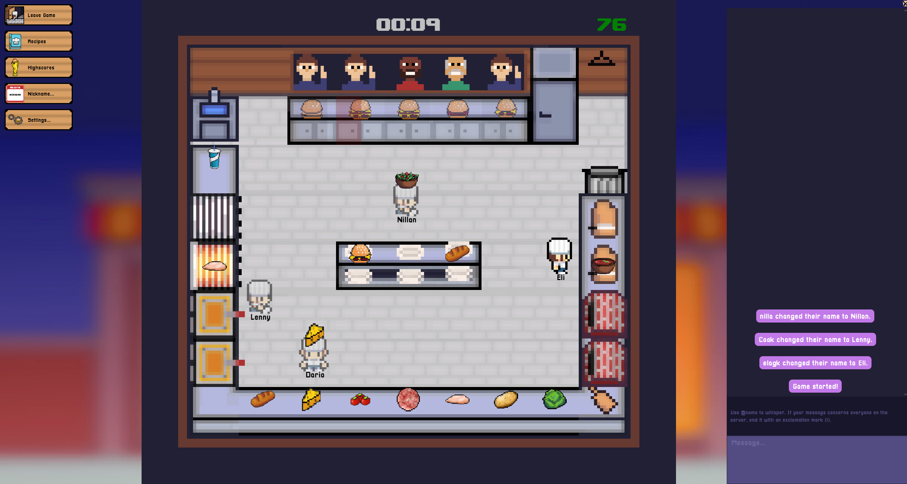

# Let Us Cook!

*Let Us Cook!* is an [*Overcooked*](https://ghosttowngames.com/overcooked/)-inspired realtime multiplayer Java game where players work together to prepare and deliver as many restaurant orders as possible during each two-minute round.



The game was created by Dario Manser, Elagkian Rajendram, Leandro Lika, and Nillan Sivarasa between March and May 2024 as part of the second semester of our Bachelor's degree of Computer Science at University of Basel, Switzerland.

## Playing

First, grab the latest pre-built JAR from the [releases](https://github.com/cookkings/letuscook/releases) or [build it yourself](#building). Once you have the JAR, you can print its command line usage by running `java -jar <JAR>`, where `<JAR>` is the path to your JAR file.

To play the game, you'll need to start a server instance and at least one client.  

For example, you can spin up a local server on port `9999` like so:  

```
java -ea -jar <JAR> server 9999
```

Then, in a different terminal, you can start a client to connect to your local server like so:

```
java -ea -jar <JAR> client localhost:9999
```

If you want to connect to your server from other machines (or even from outside your network), you can configure your network accordingly **or use a solution such as [Tailscale](https://tailscale.com/)**, which is what we used. In that case, remember to replace `localhost` with your host's IP address when starting the clients.

## Building

- Install [Gradle](https://gradle.org/) and a JDK of your choice (**ensure that your JDK includes the JavaFX runtime – we recommend the [Liberica Full JDK 17](https://bell-sw.com/pages/downloads/#jdk-17-lts)**).
- Run `gradle clean jar` in the root directory. You'll find the resulting JAR in `build/libs`.

## Testing

- To run the unit tests, use `gradle test`.
- If you wish to make use of the `test.cmd` or `test` scripts, you'll need to create a `test.ini` file in the root directory with the following contents:
  ```
  testcmd_jar=build/libs/letuscook-0.1.0.jar
  ```
  **Make sure to adjust the version number if it doesn't match.** Also, know that **`test.cmd` requires [Windows Terminal](https://www.microsoft.com/store/productId/9N0DX20HK701)** and that **`test` only works on macOS**, since it uses AppleScript.

## Contact

You can reach us via email:

- Dario Manser · d.manser@stud.unibas.ch
- Elagkian Rajendram · elagkian.rajendram@stud.unibas.ch
- Leandro Lika · leandro.lika@stud.unibas.ch
- Nillan Sivarasa · nillan.sivarasa@stud.unibas.ch
